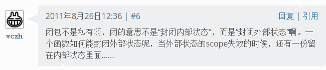

## 标题是 h2

### h3

#### h4

##### h5

没有 h6 哈哈哈哈哈。

## 图片

## 链接

[相对路径链接](../../images/vczh.png)

[绝对路径链接](/mirrors/docker.json)

[绝对路径链接 2](/mirrors/maven.xml)

https://github.com/

https://github.com/lyh543

https://github.com/lyh543?tab=repositories

## 公式

$$\LaTeX$$ 公式

## 分点

1. 第一点
2. 第二点
3. 第三点

---------------------

* 第一点
* 第二点
* 第三点